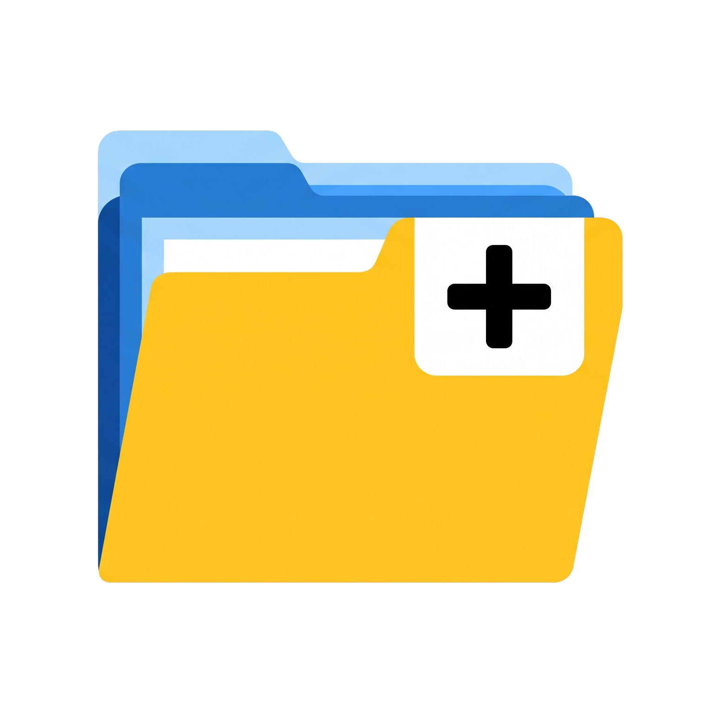
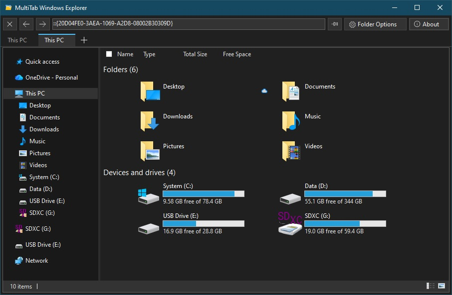

<p align="center">
  
</p>

# MultiTab Windows Explorer

A lightweight tabbed file manager for Windows. It hosts the real Windows Explorer view inside browser-style tabs, so you get the familiar folder view, context menus and shell extensions, with tabs, pinning, keyboard shortcuts and automatic dark/light mode on top.

This program was created with purpose to de-clutter the experience of file management on Windows 10 using Windows Explorer, so now you can open many different folders on Windows Explorer at the same time using tabs inside a single window. 

Because some of you including me probably thinks using another file management/commander programs were too heavy, bothersome or maybe become overwhelmed by the unnecessary features that they have.
This program may also run on Windows 11, but there's no point for doing that since Windows 11 already has tabs natively on Windows Explorer 🙃

> **Screenshots:** 
<p align="center">
  
</p>

## Features

- **Tabs for Explorer.** Open as many folders as you want in one window.
- **Native Explorer view.** Uses the Windows shell's own folder view, so right-click menus, shell extensions, drag and drop, and file operations behave like normal Explorer.
- **Pinned tabs.** Pin a tab and it reopens automatically the next time the program starts.
- **Dark and light mode.** Follows the Windows app mode, including the title bar, tabs, buttons, address bar, navigation pane, splitter and right-click menus. It switches live when you change the Windows setting.
- **Keyboard shortcuts** for opening, closing and switching tabs.
- **Mouse shortcuts.** Middle-click a tab to close it, double-click a tab to duplicate it, and use the mouse side buttons for Back and Forward.
- **Quick access to Windows Folder Options** from the toolbar.

## Shortcuts

| Action | Keyboard | Mouse |
|---|---|---|
| New tab | `Ctrl+T` | "+" button after the last tab |
| Close tab | `Ctrl+F4` | Middle-click the tab, or the Close button |
| Next tab | `Ctrl+Tab` | Click the tab |
| Previous tab | `Ctrl+Shift+Tab` | Click the tab |
| Duplicate tab | | Double-click the tab |
| Back / Forward | Browser Back / Forward keys | Mouse side buttons, or the toolbar buttons |
| Pin / unpin tab | | Pin button in the toolbar |

Closing the last remaining tab exits the program.

## Pinned tabs

- Pinning stores the folder the tab was showing at that moment.
- Pinned tabs are saved to `%AppData%\TabbedExplorer\pinned-tabs.txt` and reopened on the next launch. If you have no pinned tabs, the program opens **This PC**.
- Closing a pinned tab also unpins it.
- If a pinned folder no longer exists, that tab opens **This PC** instead.

## Requirements

- Windows 10 (32-bit, 64-bit or arm64)
- [.NET 8 Desktop Runtime](https://dotnet.microsoft.com/download/dotnet/8.0), standalone version user may skip this.

## Build from source

You need the [.NET 8 SDK](https://dotnet.microsoft.com/download/dotnet/8.0) on Windows.

```
git clone https://github.com/nidaxon/multitab-windows-explorer.git
cd multitab-windows-explorer
dotnet build -c Release
```

Publish a single executable:

```
dotnet publish -c Release -r win-x64 --self-contained false -p:PublishSingleFile=true
```

The output is in `bin\Release\net8.0-windows\win-x64\publish\`. Use `--self-contained true` if you want an executable that runs without the .NET runtime installed (the file is much larger). You can build for either x86 or arm64 version just by changing the runtime identifier option above from `win-x64` to `win-x86` or `win-arm64`

## How it works

Each tab is an `ExplorerBrowser` control from the [Windows API Code Pack](https://www.nuget.org/packages/WindowsAPICodePack-Shell). The tab strip, toolbar and dialogs are plain Windows Forms.

## Known limitations

- Dark mode inside the Explorer view relies on **undocumented Windows APIs**. It works on current Windows 10 and Windows 11 builds, but a future Windows update could change it.
- If you switch Windows between dark and light while tabs are open, an existing tab may only update fully after you navigate to another folder. New tabs always use the current mode.
- The Explorer preview pane is not supported.
- Tabs cannot be reordered, and pinned tabs are not moved to the left of the tab strip.
- A duplicated tab opens at the same folder but starts with a fresh Back/Forward history.
- Windows only.

## License

This program is licensed under the [GNU General Public License v3.0](https://www.gnu.org/licenses/gpl-3.0.html). See the `LICENSE` file for the full text.

## Disclaimer

This program is an independent project and is not affiliated with, endorsed by, or sponsored by Microsoft Corporation. Windows is a registered trademark of Microsoft Corporation.
